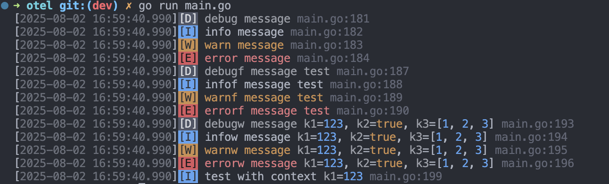

# Mo

A leveled logger library for golang.

**Features**

- Support level log
- Support file line number
- Support for distinguishing log modules
- Support log colors
- Support for custom formatting

```sh
go get github.com/mengdu/mo
```

```go
package main
import (
	"github.com/mengdu/mo"
)

func main() {
	mo.Error("Error message")
	mo.Warn("Warn message")
	mo.Info("Warn message")
	mo.Log("Log message")
	mo.Success("Success message")
	mo.Debug("Debug message")
	mo.With(map[string]interface{}{
		"a": 1,
	}).Info("With meta message")
}
```

[Example](examples/main.go)



## Levels

````
LEVEL_NONE
LEVEL_ERROR
LEVEL_WARN
LEVEL_INFO
LEVEL_LOG
LEVEL_SUCCESS
LEVEL_DEBUG
LEVEL_ALL
````

```go
logger := mo.New()
logger.Level = mo.LEVEL_ALL
```

## Production recommendations

```go
file, _ := os.OpenFile("service.log", os.O_CREATE|os.O_WRONLY|os.O_APPEND, 0666)
errfile, _ := os.OpenFile("service-err.log", os.O_CREATE|os.O_WRONLY|os.O_APPEND, 0666)
logger := mo.New()
logger.Formater = &mo.JsonForamter{}
logger.Stdout = file
logger.Stderr = errfile
logger.Level = mo.LEVEL_SUCCESS
```

## Benchmark

```
go test -cpu=4 -benchmem -benchtime=5s -bench "^Benchmark"
goos: darwin
goarch: amd64
pkg: github.com/mengdu/mo
cpu: Intel(R) Core(TM) i7-8700B CPU @ 3.20GHz
BenchmarkNone-4                 1000000000               0.5773 ns/op          0 B/op          0 allocs/op
BenchmarkDefault-4              19812234               315.4 ns/op           384 B/op         15 allocs/op
BenchmarkWith-4                   936283              6774 ns/op            7416 B/op         68 allocs/op
BenchmarkWithTag-4               7291065               847.5 ns/op           464 B/op         23 allocs/op
BenchmarkCaller-4                5136397              1081 ns/op             800 B/op         25 allocs/op
BenchmarkFull-4                  3293016              1849 ns/op            2057 B/op         66 allocs/op
BenchmarkJsonForamter-4         12249668               497.5 ns/op           460 B/op          8 allocs/op
BenchmarkGoLog-4                12026568               464.6 ns/op           264 B/op          3 allocs/op
PASS
ok      github.com/mengdu/mo    48.118s
```
